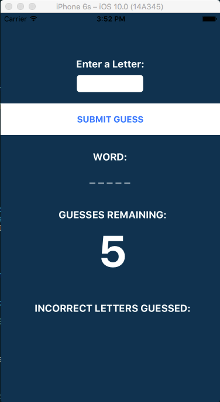

# HANGMAN

* This is a basic hangman app, currently optimized for an iPhone 6s or 7.
* It's my first attempt at writing a Swift app, any pull requests at making my code more efficient would be appreciated.

```
git clone git@github.com:notmarkmiranda/hangman.git
cd hangman
open hangman.xcodeproj/
```


### Screenshot

